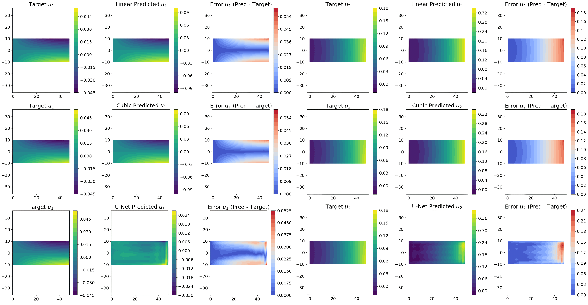
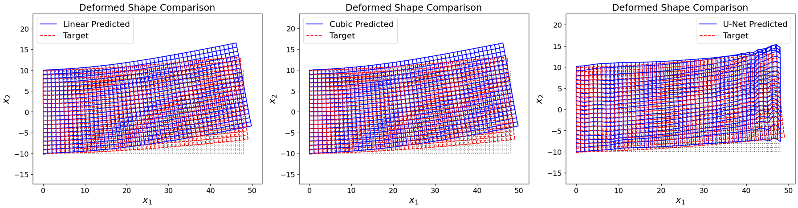

# Physics_Informed_U-Net
This repository contains my custom final project for the SE232: Machine Learning in Computational Mechanics course. The objective was to train a U-Net to predict displacement fields in a 2D elastic plate subjected to different load conditions. The model was trained on RKPM-generated data and evaluated using both mean squared error (MSE) and an energy-based residual loss formulation.





## Contents:
* dataset.mat - displacement fields, traction fields, prescribed displacements, material constitutive matrix, RKPM shape functions, and shape function gradients *
* unet_main.py - used to spawn training process
* unet_train.py - contains training and validation functions
* loss_func.py - contains energy residual loss function
* dataset.py - contains dataset preprocessing and train/test split functions
* unet.py - contains model architecture
* global_var.py - contains dictionary for storing global variables
* plots.py - contains functions for plotting main evaluation figures
* unet_train.ipynb - calls training functions and visualizes all training and testing results
* poly_regression_train.ipynb - contains training for linear and cubic regression models for comparison
* Results/ - contains checkpoints, training outputs, and saved weights for the U-Net *

dataset.mat and Results/ directory can be downloaded from [Google Drive](https://drive.google.com/drive/folders/1U5bF-VX-6mN9UPSLozbwqIWhyRJYIvuD?usp=drive_link) due to upload size limitations.  

## Requirements:
* Python 3.10
* PyTorch
* NumPy
* Matplotlib
* Sci-kit Learn
* SciPy
* Pandas

Install dependencies:
```
# ! pip uninstall torch torchvision torchaudio -y
# ! pip install torch --index-url https://download.pytorch.org/whl/cu130
# ! pip install numpy
# ! pip install scikit-learn
# ! pip install scipy
# ! pip install matplotlib
# ! pip install pandas
```

## Running the code:
* Download directory
* Modify `dataroot` in global_var.py to your working directory
* If using Google Colab: Modify `base_pth` in unet_train.ipynb (and poly_regression_train.ipynb) to directory
* Run the notebooks

## Dataset:
The dataset was generated using a previously developed RKPM solver script written in MATLAB. The displacements were obtained using a linear basis, cubic B-spline shape functions, and equally spaced nodes. Different combinations of load types were considered, such as distributed loads and point loads, with the magnitudes of the load parameters varying by case. All load cases were applied to a standardized 2D simply-supported cantilever beam with the dimensions labelled in Figure \ref{fig:problem_domain}. The dimensions of the beam used were length L=48 and width W=20. The beam was assigned a Young's modulus of 1 and Poisson's ratio of 0.3. For analysis, the domain was discretized into 49 $\times$ 21 nodes for an average nodal spacing of 1. Furthermore, the free end was designated as the natural boundary at which all loads were applied. The essential boundary was denoted by the simple supports on the left-hand side and kept consistent across all load cases. After running each load case, the resulting displacements were separated into their x and y components. The solutions for each case were stored as a 1029 $\times$ 2 matrix where the rows correspond to the displacements at each node, and the columns correspond to the dimensions. Additionally, the tractions for each case were saved as a matrix with the same dimensions. In this study, the displacements were the target, while the tractions were the labels. The essential boundary conditions in the nodal space were saved as a standalone mesh grid matrix to be used as an input. This acted as an initialization of the nodal displacements, where the values are the prescribed displacements on the essential boundary and zero elsewhere. The node-based input provided a more meaningful feature representation than a latent noise input used by traditional convolution-based models. Similarly, the material constitutive $\mathbf{D}$ matrix for plane strain was saved to be used in energy residual loss calculation. The RKPM shape functions for each node and their gradients were included in the dataset but were not used in training the U-Net. 

## Models:
* U-Net (modified)
* Linear Regression
* Cubic Regression

## Evaluation metrics:
* Mean Squared Error (MSE)
* Energy Residual Loss

Performance:

| Model             | MSE      | Energy |
|------------------|-----------|----------|
| Linear Regression | 0.000830 | 3.277600 |
| Cubic Regression  | 0.000828 | 3.265300 |
| U-Net             | 0.000038 | 0.365661 |

## References:

```bibtex
@article{clough1990original,
  title={Original formulation of the finite element method},
  author={Clough, Ray W},
  journal={Finite elements in analysis and design},
  volume={7},
  number={2},
  pages={89--101},
  year={1990},
  publisher={Elsevier}
}

@article{liu1995reproducing,
  title={Reproducing kernel particle methods},
  author={Liu, Wing Kam and Jun, Sukky and Zhang, Yi Fei},
  journal={International journal for numerical methods in fluids},
  volume={20},
  number={8-9},
  pages={1081--1106},
  year={1995},
  publisher={Wiley Online Library}
}

@article{liu1996overview,
  title={Overview and applications of the reproducing kernel particle methods},
  author={Liu, Wing Kam and Chen, Y and Jun, S and Chen, JS and Belytschko, T and Pan, C and Uras, RA and Chang, CT1379414},
  journal={Archives of Computational Methods in Engineering},
  volume={3},
  number={1},
  pages={3--80},
  year={1996},
  publisher={Springer}
}

@book{belytschko2023meshfree,
  title={Meshfree and particle methods: fundamentals and applications},
  author={Belytschko, Ted and Chen, Jiun-Shyan and Hillman, Michael},
  year={2023},
  publisher={John Wiley \& Sons}
}

@inproceedings{ronneberger2015u,
  title={U-net: Convolutional networks for biomedical image segmentation},
  author={Ronneberger, Olaf and Fischer, Philipp and Brox, Thomas},
  booktitle={International Conference on Medical image computing and computer-assisted intervention},
  pages={234--241},
  year={2015},
  organization={Springer}
}

@article{jiangtao2025comprehensive,
  title={A Comprehensive Review of U-Net and Its Variants: Advances and Applications in Medical Image Segmentation},
  author={Jiangtao, Wang and Ruhaiyem, Nur Intan Raihana and Panpan, Fu},
  journal={IET Image Processing},
  volume={19},
  number={1},
  pages={e70019},
  year={2025},
  publisher={Wiley Online Library}
}

@article{baek2022neural,
  title={A neural network-enhanced reproducing kernel particle method for modeling strain localization},
  author={Baek, Jonghyuk and Chen, Jiun-Shyan and Susuki, Kristen},
  journal={International Journal for Numerical Methods in Engineering},
  volume={123},
  number={18},
  pages={4422--4454},
  year={2022},
  publisher={Wiley Online Library}
}

@article{wang2026neural,
  title={Neural network-enriched RKPM for dynamics based on action minimization},
  author={Wang, Yanran and Chen, Jiun-Shyan and Casebolt, Samuel E},
  journal={Computer Methods in Applied Mechanics and Engineering},
  volume={451},
  pages={118662},
  year={2026},
  publisher={Elsevier}
}

@article{raissi2017physics,
  title={Physics informed deep learning (part i): Data-driven solutions of nonlinear partial differential equations},
  author={Raissi, Maziar and Perdikaris, Paris and Karniadakis, George Em},
  journal={arXiv preprint arXiv:1711.10561},
  year={2017}
}

@article{cuomo2022scientific,
  title={Scientific machine learning through physics--informed neural networks: Where we are and what’s next},
  author={Cuomo, Salvatore and Di Cola, Vincenzo Schiano and Giampaolo, Fabio and Rozza, Gianluigi and Raissi, Maziar and Piccialli, Francesco},
  journal={Journal of Scientific Computing},
  volume={92},
  number={3},
  pages={88},
  year={2022},
  publisher={Springer}
}

@article{zhou2019normalization,
  title={Normalization in training U-Net for 2-D biomedical semantic segmentation},
  author={Zhou, Xiao-Yun and Yang, Guang-Zhong},
  journal={IEEE Robotics and Automation Letters},
  volume={4},
  number={2},
  pages={1792--1799},
  year={2019},
  publisher={IEEE}
}

@book{Goodfellow-et-al-2016,
    title={Deep Learning},
    author={Ian Goodfellow and Yoshua Bengio and Aaron Courville},
    publisher={MIT Press},
    note={\url{http://www.deeplearningbook.org}},
    year={2016}
}
